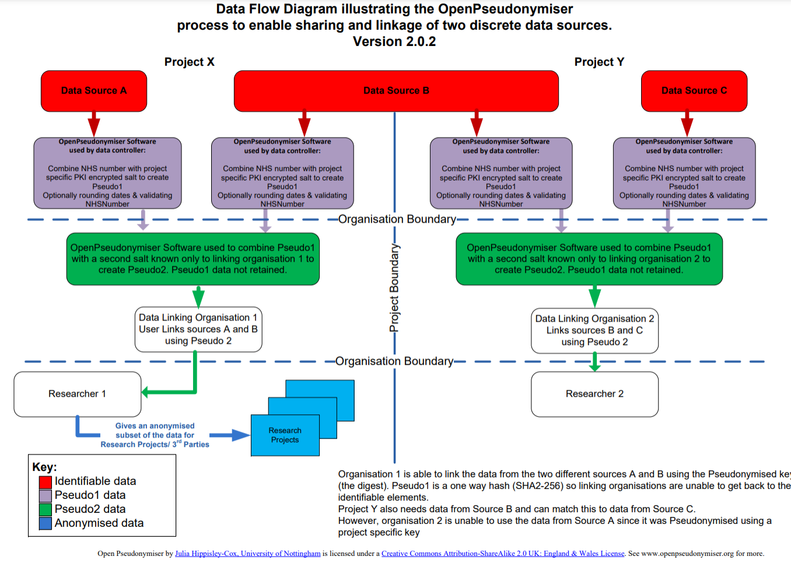

# OpenPseudonymiser

A public-key cryptography library useful for de-identifying datasets.

Original codebase and desktop software available at https://www.openpseudonymiser.org



## Dependencies

Java v1.5 or higher, and Ant for building.

### Java with scoop.sh (windows)

```
scoop bucket add java
scoop install java/zulu-jdk
scoop install main/ant
```

## Build

Compile and test by running: `ant` at the command prompt.

## Docs

### Terms Used 

**Input:** A concatenation of the fields the user has selected to use in the creation of the Digest (e.g. NHSNum + DOB)

**Salt:** Extra characters added to the input

**Digest:** The long string that comes out of the cryptographic hash function

### Digest Creation

The digest is a SHA-2 (SHA256 variant) hash of the concatenated columns with the salt appended to the end.

e.g. if the columns NHSNumber and DOB were selected with the salt "mackerel" then the digest creation would follow the steps:

1.   "29.11.2011" + "9434765919" + "mackerel"
2.   Concatenated to: "29.11.20119434765919mackerel"
3.   Run through SHA256
4.   The digest = "5dfc32ba81ea3e016333687111ae2f63d97dad05adf92c61bf06438a08d8bc56"

Note that all the inputs are treated as strings, different formats for the DOB (slashes rather than dots), 2 rather than 4 digits will change the digest. 

It is therefore very important to agree on standardised formats for all the fields you plan to use in the creation of the digest.

As mentioned above all fields are treated as strings, no processing or validation is performed. The only exception is if a field is named "NHSNumber". If such a field is found then the JAR will strip all spaces from the field before adding it to the input.

#### Order of columns

The input columns will always be arranged alphabetically. In the above example the DOB column comes **after the** NHS Number column in the input file, but DOB is concatenated **before** NHS number because "DOB" comes before "NHS Number" alphabetically. This is all handled automatically by the JAR.

#### Blank removal

Before any column is used in the digest all "blanks" are removed from it. Newline, Carriage Return, Space and Tab are all removed from any data before being used in the Digest. 

This is a very important point and means OpenPseudonymiser should not be used to create digests for things like full names, postcodes and other data that may contain spaces.

### Using the JAR

The JAR is called: `OpenPseudonymiser.CryptoLib.jar` and is built to be compatible with Java 1.5 and later.

#### Using the JAR in your application

```java
import OpenPseudonymiser.Crypto;
```

You can now instantiate the Crypto object using the following line of code:

```java
Crypto crypto = new Crypto();
```

#### Example call 

The following code is an example of how to call the CryptoLib


```java
boolean success = false;

Crypto crypto = new Crypto();

// set the salt to a plain text word/phrase

String salt = "mackerel";

crypto.SetPlainTextSalt(salt);

// The input: a name/value pair

TreeMap nameValue = new TreeMap();

// any spaces in the special case field called \'NHSNumber\' will be
stripped out

nameValue.Put("NHSNumber", "9434765919");

// even though we add DOB after we add NHS, it will come before
NHSNumber in the input, since the SortedList will always order by
alphabetical key

nameValue.Put("DOB", "29.11.1973");

// Call the GetDigest method and receive the digest..

String digest = crypto.GetDigest(nameValue);

// we expect the following digest for the above values

success = (digest ==
"ED72F814B7905F3D3958749FA90FE657C101EC657402783DB68CBE3513E76087");

System.out.println("Test for (nonEncryptedSalt): " + success);
```

#### Blank salt

Blank salt is not allowed, the library will throw an exception if a call to GetDigest is made with either no salt set, or a blank string set as the salt.

### Encrypting the salt

It is possible to call the digest function without knowledge of the salt. Using encrypted salt provides another level of security by removing knowledge of the salt data from the users of package.

The site www.openpseudonymiser.org allows you to create encrypted salt files for use with the package. The salt file is encrypted using a PKI (Public Key Infrastructure) technique. The salt word is encrypted using a private key known only to The University of Nottingham (the owners of the www.openpseudonymiser.org site)

The encrypted salt file can be used with the class in the same way as the example call in section 4.3 with the following change:

Instead of calling:

```java
// set the salt to a plain text word/phrase

String salt = "mackerel";

crypto.SetPlainTextSalt(salt);
```

Do this instead:

```java
File encryptedSalt = new File("path/to/local_copy_of.EncryptedSalt");

crypto.SetEncryptedSalt(encryptedSalt);
```

Replacing the location of your encrypted salt file as appropriate

If need to store the encrypted salt in a database or some other non-filesystem location, you can do this:

```java
byte[] encryptedSaltData = getMyEncryptedSaltBytes();

crypto.SetEncryptedSalt(encryptedSaltData);
```

## Licensing

OpenPseudonymiser is Copyright Julia Hippisley-Cox, University of Nottingham 2011.

OpenPseudonymiser is free software: you can redistribute it and/or modify it under the terms of the GNU General Public License as published by the Free Software Foundation, either version 3 of the License, or (at your option) any later version.

OpenPseudonymiser, including the website, software, documentation and key server technology, is distributed in the hope that it will be useful, but WITHOUT ANY WARRANTY; without even the implied warranty of MERCHANTABILITY or FITNESS FOR A PARTICULAR PURPOSE. See the [GNU General Public License](http://www.gnu.org/licenses/) for more details.

Organisations who wish to make use of the Open Pseudonymiser technology have full responsibility for regarding information governance and security considerations relevant to their purposes. The Key Server on this website is intended for demonstration purposes only. Organisations wishing to use Open Pseudonymiser for production purposes should deploy an instance of the software/key server etc suitable for their own purposes in order to satisfy their own information governance and security requirements.

Please see the following document entitled "Anonymisation: managing data protection risk code of practice" (https://ico.org.uk/media/1061/anonymisation-code.pdf)
The case study on page 79 has an example of using the cryptographic hash technique.

The java libraries are released under the GNU Lesser Public License 3 (http://www.gnu.org/licenses/lgpl.html)

The University of Nottingham thanks QResearch (www.qresearch.org) for contributing to the cost of developing this software.

### Open source 

OpenPseudonymiser makes use of the following Open Source libraries:
- RSAEncryption Class Version 1.00 which is Copyright (c) 2009 Dudi Bedner (http://www.codeproject.com/KB/security/PrivateEncryption.aspx)
- BigInteger Class Version 1.03 which is Copyright (c) 2002 Chew Keong TAN (http://www.codeproject.com/KB/cs/biginteger.aspx)
- The NHSNumber validation code is based on an Open Source work by Peter Fisher. The original NHSNumber validation code can be found on here on GitHub (https://github.com/pfwd/NHSNumber-Validation)
